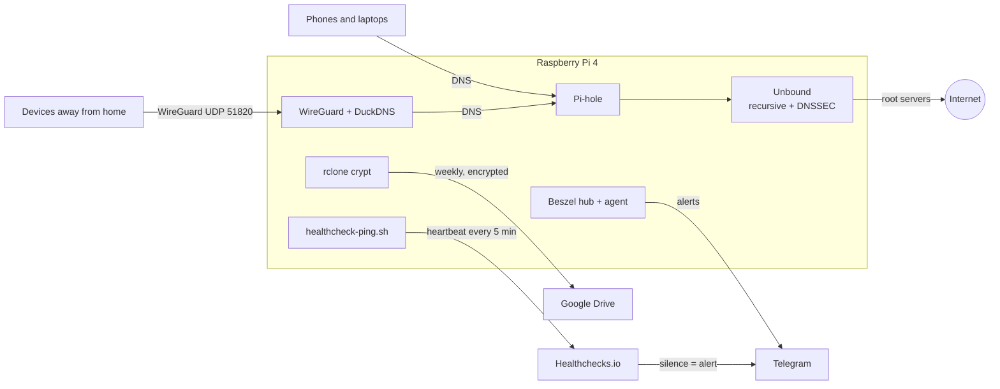

# Homelab — Raspberry Pi 4

Infrastructure-as-code for the Raspberry Pi 4 that runs my home network
services. Everything runs in Docker, every image is pinned, and anything that
is not in Git is covered by an encrypted weekly backup, so a dead SD card is a
restore, not a rebuild.

**Hardware:** Raspberry Pi 4, 1 GB RAM, 64 GB SD card, Debian Trixie arm64,
Wi-Fi (`wlan0`), no RTC. Reserved LAN IP `192.168.15.5`, SSH as `admin`.



## Services

| Folder | What it does |
|---|---|
| [`pihole/`](pihole/) | Home DNS: Pi-hole for ad blocking, Unbound as a recursive, DNSSEC-validating upstream. Also holds `setup-host.sh`, which prepares the OS. |
| [`wireguard/`](wireguard/) | VPN with DuckDNS for the dynamic public IP. Routes all client traffic through the tunnel so ad blocking follows the devices outside home. |
| [`beszel/`](beszel/) | Monitoring (CPU, memory, disk, temperature, containers) with Telegram alerts, plus a dead man's switch for when the Pi itself is down. |
| [`backup/`](backup/) | Weekly encrypted backup to Google Drive of all state that Git does not hold. |

Each folder mirrors a folder in `~/docker/` on the Pi and has its own README
(in Portuguese) with the full setup, variables and design decisions.

## Design decisions

- **Pinned image tags, never `:latest`.** Upgrading is changing a tag; rollback
  is changing it back. Dependabot opens a PR every Saturday when a new tag
  ships.
- **No third-party resolver.** Unbound resolves from the root servers, so no
  DNS provider sees the household's browsing history, and it is bound to
  `127.0.0.1` only, so it cannot be abused for amplification attacks.
- **Two alerting paths.** Beszel catches problems while the Pi is up. It runs on
  the Pi, though, so it dies with it. A cron job therefore sends a heartbeat to
  Healthchecks.io every 5 minutes, and *silence* raises the alert. The
  heartbeat checks DNS first, because a Pi that is on with broken DNS is as bad
  as a Pi that is off.
- **Encrypted before it leaves the Pi.** Backups go through an rclone `crypt`
  remote, with `drive.file` scope (rclone only sees files it created) and
  8-week retention. The job runs daily but backs up only when the last success
  is older than 6 days, so a day with the Pi off delays the backup instead of
  skipping the week. Pi-hole is exported with Teleporter and Beszel is briefly
  stopped, so the SQLite files are consistent.
- **Built for an SD card and 1 GB of RAM.** log2ram keeps `/var/log` in memory,
  Pi-hole keeps 30 days of queries instead of 91, and the journal size is capped.
- **Least privilege.** The monitoring agent gets the Docker socket read-only;
  secrets live in git-ignored `.env` files and in the backup, never in Git.
- **Host networking only where it is needed.** Pi-hole needs it to see each
  client's real IP; the Beszel hub stays on a bridge network.

Some of the less obvious fixes are documented where they apply. For example,
the distroless Unbound image needs `do-daemonize: no` or the container exits in
a loop, and Raspberry Pi OS needs `cgroup_enable=memory` before per-container
memory stats work at all.

## Operating it

The Pi has no clone of this repo; files are copied over SSH. Send the
**committed** version (LF), not the Windows working tree, which may be CRLF.
From Git Bash:

```bash
git show HEAD:pihole/docker-compose.yml | ssh admin@192.168.15.5 'cat > ~/docker/pihole/docker-compose.yml'
ssh admin@192.168.15.5 'cd ~/docker/pihole && docker compose up -d'
```

To check that the Pi matches Git, compare the `sha256sum` of `git show` with
that of the file on the Pi. Merging a Dependabot PR does **not** deploy: copy
the compose file over and run `docker compose pull && docker compose up -d`.

### Restore from scratch

1. Flash Raspberry Pi OS (64-bit) with user `admin`.
2. Copy every folder to `~/docker/`:
   ```bash
   git archive HEAD pihole wireguard beszel backup | ssh admin@192.168.15.5 'mkdir -p ~/docker && tar -x -C ~/docker'
   ```
3. Prepare the OS: `~/docker/pihole/setup-host.sh`, then `sudo reboot`.
4. Pull the state back from Google Drive (`.env` files, keys, data, crontab):
   see [`backup/`](backup/).
5. Start each service following its README, beginning with
   [`pihole/`](pihole/), which has the DNSSEC trust anchor step.

## History

On 2026-10-03 this repo merged four separate repos (`pihole-docker`,
`wireguard-docker`, `beszel-docker` and `backup-docker`) with `git subtree`,
keeping their commit history. Commits from before the merge show the original
paths, without the folder prefix.

## License

[MIT](LICENSE)
