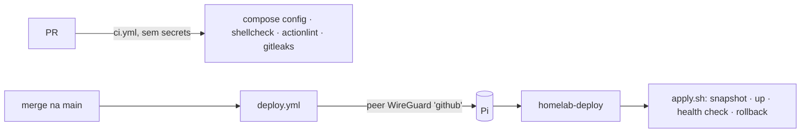

# Deploy automático

Todo merge na `main` que mexe numa pasta de serviço chega sozinho ao Pi. Os
`.env` são montados com os **secrets do GitHub** (Environment `production`),
que passam a ser a fonte da verdade das senhas.



## Como funciona

1. O `ci.yml` valida o PR. Ele roda sem acesso a nenhum secret, inclusive em PR
   de fork e do Dependabot.
2. No merge, o `deploy.yml` roda o CI de novo e monta o pacote: `git archive`
   das pastas + `.env` gerados pelo [`render-env.sh`](render-env.sh) a partir do
   [`env-manifest`](env-manifest).
3. O runner entra na rede de casa como o peer `github` do WireGuard. A config
   dele só roteia `192.168.15.5`.
4. Pelo SSH, a chave de deploy só consegue chamar o
   [`receiver.sh`](receiver.sh) (`command=` forçado no `authorized_keys`).
   Ele recebe o pacote e roda o [`apply.sh`](apply.sh) que veio dentro.
5. O `apply.sh` compara serviço a serviço e só mexe no que mudou: snapshot,
   copia, `pull`, `up -d`, health check. Se o health check falhar, volta o
   snapshot e o run fica vermelho. O WireGuard vai por último, porque o deploy
   dele derruba o túnel do próprio runner, que reconecta e espera o resultado.

Serviço sem mudança não reinicia. Arquivo montado que não é o compose (como o
`unbound.conf`) faz o container ser recriado, porque o compose não percebe
essa mudança sozinho.

**Os logs do Actions são públicos.** O deploy imprime só nomes de serviço, de
arquivo e de chave do `.env`, nunca valores.

## Secrets do Environment `production`

| Secret | O que é |
|---|---|
| `WG_CLIENT_CONF` | Config do peer `github`, com `AllowedIPs = 192.168.15.5/32` e sem `DNS` |
| `DEPLOY_SSH_KEY` | Chave privada de deploy (a pública fica no `authorized_keys` do Pi, presa ao receiver) |
| `PI_SSH_HOST_KEY` | Linha do `known_hosts` do Pi (`ssh-keyscan -t ed25519 192.168.15.5`) |
| `PIHOLE_PASSWORD`, `DUCKDNS_SUBDOMAIN`, `DUCKDNS_TOKEN`, `DDNS_DOMAIN`, `WG_PEERS`, `BESZEL_KEY`, `BESZEL_HC_PING_URL`, `BACKUP_HC_PING_URL` | Valores dos `.env`, mapeados no [`env-manifest`](env-manifest) |
| `PIHOLE_CLIENTS_LIST` | Opcional. Conteúdo do `pihole/clients.list`; quando muda, o deploy roda o `clients.sh` |
| `TELEGRAM_BOT_TOKEN`, `TELEGRAM_CHAT_ID` | Opcionais. Aviso de cada deploy no Telegram |

Secret do manifesto vazio ou ausente faz o deploy parar antes de conectar.

## Ligar pela primeira vez

No PC, pelo Git Bash, na raiz do repo:

```bash
./deploy/bootstrap.sh
```

Ele cria o Environment, o peer `github` (a VPN pisca por alguns segundos),
a chave de deploy, instala o receiver no Pi e copia os valores dos `.env` do
Pi direto para os secrets, sem mostrar nada na tela. Também cria a variável
`DEPLOY_DRY_RUN=true`, que deixa todo deploy em modo de conferência.

Depois do merge, conferir no log do run que nada inesperado mudaria e então
liberar os deploys de verdade:

```bash
gh variable delete DEPLOY_DRY_RUN -R thomazcampos07/homelab
```

## Operação

- **Trocar uma senha:** editar o secret em *Settings → Environments →
  production* e rodar *Actions → Deploy → Run workflow*. Só o serviço afetado
  é recriado.
- **Conferir sem aplicar:** *Run workflow* com *dry_run* marcado.
- **Variável nova num `.env`:** linha nova no `env-manifest` + secret novo. O
  CI falha se um compose usar variável que não está no manifesto.
- **Ver o que está no Pi:** `~/docker/.deploy/deployed-sha` tem o commit
  aplicado; `~/docker/.deploy/runs/` guarda os últimos 10 runs com log.
- **Deploy manual (plano B, sem a esteira):** o caminho antigo continua
  valendo, ver o README da raiz.

O `receiver.sh` **não** é atualizado pelo pipeline: é a âncora de confiança.
Se ele mudar, reinstalar com `./deploy/bootstrap.sh` (ou só o
[`install.sh`](install.sh) no Pi).

## Restauração do zero

O túnel depende do WireGuard já estar de pé no Pi, então a ordem é:
`setup-host.sh` → restaurar o backup (traz `.env` e `wireguard/config`) →
subir o `wireguard` à mão → `./deploy/bootstrap.sh` → *Run workflow*.
